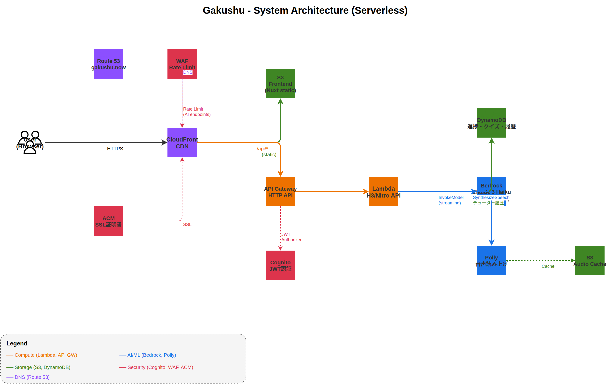

# Gakushu

GPTの仕組みを一般人にも理解してもらうためのインタラクティブ学習サイト。Embedding、Attention、Transformerまで段階的に可視化しながら、AIが個別にチューターとして教えてくれる。

## 構成図



> [docs/architecture.drawio](docs/architecture.drawio) を draw.io で開くと編集できる

## 使った技術

| | |
|---|---|
| バックエンド | TypeScript + H3/Nitro (Lambda) |
| フロント | Nuxt 4, Nuxt UI (Reka UI), Tailwind CSS v4 |
| 認証 | Cognito (JWT) |
| DB | DynamoDB (シングルテーブル設計) |
| AI | Bedrock (Claude) — チューター・理解度チェック・パーソナライズ解説 |
| 音声 | Polly — 章の音声読み上げ |
| IaC | Terraform (S3バックエンド + DynamoDB state lock) |
| CI/CD | GitHub Actions |
| 配信 | CloudFront (S3 + API Gateway を同一ドメインで配信) |

## 使ってるAWSサービス

| サービス | 何してるか |
|---------|-----------|
| Lambda | TypeScript API (H3/Nitro) |
| API Gateway | HTTPリクエストをLambdaにルーティング + Cognito JWT認証 |
| DynamoDB | ユーザー進捗・クイズ結果・チューター履歴の保存 |
| S3 | フロントのビルド成果物 + Polly音声キャッシュ + Terraform state |
| CloudFront | CDN。S3とAPI Gatewayの前に立ってHTTPS配信 |
| Cognito | ユーザー登録、ログイン、JWT発行 (学習進捗の紐付け) |
| Bedrock | Claude によるAIチューター、理解度チェック、パーソナライズ解説 |
| Polly | 章の解説テキストを音声に変換 |
| WAF | AIエンドポイントへのレート制限 (コスト防止) |
| Route 53 | カスタムドメイン (gakushu.now) のDNS管理 |
| ACM | SSL証明書 (gakushu.now + *.gakushu.now) |
| IAM | LambdaにDynamoDB/Bedrock/Polly/S3のアクセス権限を付与 |

## 機能

- GPTの仕組みを5章で段階的に学習 (基礎LM → Attention → GPT)
- インタラクティブな可視化 (Embedding表、Attention ヒートマップ、Loss推移等)
- 数学もチャプター内でインライン解説 (log, Σ, ベクトル, 内積, 偏微分)
- AIチューター: 可視化を見ながら質問できる (Bedrock Claude)
- 理解度チェック: 章の最後にAIが口頭試問
- パーソナライズ: 職業や知識レベルに応じた比喩で解説
- サンドボックス: 自分のテキストで学習過程を体験
- 音声読み上げ (Polly)
- ユーザー認証 + 学習進捗の保存

## ディレクトリ構成

```
gakushu/
├── api/          # TypeScript H3/Nitro API (Lambda デプロイ)
├── web/          # Nuxt 4 フロント (Nuxt UI + Tailwind CSS v4)
├── infra/        # Terraform (Cognito, DynamoDB, Bedrock, Polly, CloudFront, Lambda, WAF)
├── docs/         # 構成図 (draw.io) + OpenAPI
└── .github/      # GitHub Actions (CI/CD)
```

## API

| Method | Path | 何するか |
|--------|------|---------|
| GET | `/api/auth/me` | ユーザー情報取得 |
| GET | `/api/progress` | 全章の進捗一覧 |
| PUT | `/api/progress/:chapterId` | 章の進捗更新 |
| GET | `/api/quiz/:chapterId` | クイズ問題取得 (Bedrock生成) |
| POST | `/api/quiz/:chapterId` | 回答提出 → Bedrock評価 |
| POST | `/api/tutor/ask` | AIチューターに質問 (SSE streaming) |
| GET | `/api/narration/:chapterId` | Polly音声取得 (S3キャッシュ) |
| POST | `/api/sandbox/explain` | ユーザーテキストで学習ナレーション |

## ローカルで動かす

開発ツールは全部floxで管理してるので、まずfloxを入れる。

```bash
nix profile install --accept-flake-config github:flox/flox
```

あとはactivateすればnode, pnpm, terraform等が全部使える。

```bash
flox activate

# DynamoDB Local を起動
make db

# API起動 (別ターミナル)
make api    # http://localhost:3001

# フロント起動 (別ターミナル)
make web    # http://localhost:3000
```

ローカルではBedrock/Pollyはモックモード (`BEDROCK_MOCK=true`)。Cognito認証もスキップ (`DEV_USER_ID`)。

## デプロイ

mainブランチへのマージで GitHub Actions CD パイプラインが自動実行される。
ローカルからの `terraform apply` は禁止。

```bash
# ローカルで許可されるのは plan と validate のみ
cd infra && terraform plan
```

## コストについて

サーバーレス構成なので、アクセスがなければほぼ $0。
Bedrockは従量課金だが、WAFでレート制限 (1分10リクエスト) を設定してコスト防止。
DynamoDBはオンデマンドモード。月額 $1〜5 程度。
