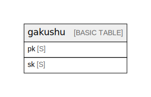

# Amazon DynamoDB (ap-northeast-1)

## Tables

| Name                  | Attributes | Comment                                                                                                                                                                                                                                                                                                                                                | Type        |
| --------------------- | ---------- | ------------------------------------------------------------------------------------------------------------------------------------------------------------------------------------------------------------------------------------------------------------------------------------------------------------------------------------------------------ | ----------- |
| [gakushu](gakushu.md) | 2          | Single-table design. 4 logical entities (User Profile / Progress / Quiz / Narration cache) are stored under different PK/SK prefixes. TTL on `ttl` attribute (Unix timestamp) for cache expiry. See ../entities.md and ../access-patterns.md for full attribute definitions (tbls cannot infer non-key attributes from DynamoDB).  | BASIC TABLE |

## Relations

---

> Generated by [tbls](https://github.com/k1LoW/tbls)
