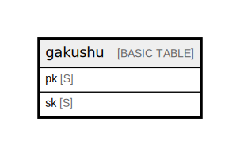

# gakushu

## Description

Single-table design. 4 logical entities (User Profile / Progress / Quiz / Narration cache)  
are stored under different PK/SK prefixes. TTL on `ttl` attribute (Unix timestamp) for  
cache expiry. See ../entities.md and ../access-patterns.md for full attribute definitions  
(tbls cannot infer non-key attributes from DynamoDB).  

## Attributes

| Name | Type | Default | Nullable | Children | Parents | Comment                                                                                                                                                                                                                                                                                                                                                      |
| ---- | ---- | ------- | -------- | -------- | ------- | ------------------------------------------------------------------------------------------------------------------------------------------------------------------------------------------------------------------------------------------------------------------------------------------------------------------------------------------------------------ |
| pk   | S    |         | false    |          |         | Partition key. Prefix determines the entity scope:   USER#{cognito_sub}        User-scoped data (Profile / Progress / Quiz)   NARR#{chapterId}          Narration cache (shared across users)                                                                                                                                                 |
| sk   | S    |         | false    |          |         | Sort key. Prefix determines the entity type:   PROFILE                                User profile (single per user)   PROG#{chapterId}                       Learning progress per chapter   QUIZ#{chapterId}#{ISO8601}             Quiz result history   LANG#ja                                Narration cache language variant  |

## Primary Key

| Name        | Type                       | Definition                                                                           |
| ----------- | -------------------------- | ------------------------------------------------------------------------------------ |
| Primary Key | Partition key and sort key | [{ AttributeName: "pk", KeyType: "HASH" } { AttributeName: "sk", KeyType: "RANGE" }] |

## Relations

---

> Generated by [tbls](https://github.com/k1LoW/tbls)
